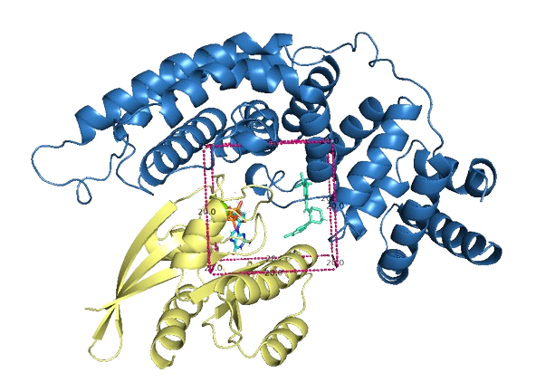

# ML Tools for Biocatalysis

## Overview

**ML Tools for Biocatalysis** is a project completed as part of my final master’s dissertation in the Rosta Lab at University College London (UCL). This project leverages machine learning (ML) to enhance drug discovery efforts, specifically targeting oncogenic RAS mutations. The project focuses on using computational tools to identify ligands that improve the catalytic efficiency of GTPase Activating Proteins (GAPs), which play a crucial role in restoring normal cellular signaling pathways disrupted by mutations in RAS protein.

### Achievements

- Achieved an **80% grade** for this master’s dissertation project.
- **Advanced Feature Selection**: Developed a robust pipeline combining LASSO, Mutual Information, and Random Forest techniques for optimal feature selection.
- **Innovative Machine Learning Models**: Implemented Random Forest, Support Vector Regression, and Deep Neural Networks to predict the QM/MM SP Barrier of ligands.
- **Dataset Refinement**: Curated a dataset with over 8,000 ligands, enriched with chemical and physical descriptors, improving model performance.
- **Ligand Identification**: Identified potential ligand candidates for GAP reactivation, demonstrating the utility of ML in biocatalysis.

---

## Features

1. **Feature Selection Pipeline**:
   - Combines linear (LASSO) and non-linear (Mutual Information) techniques.
   - Refines high-dimensional datasets for improved model interpretability.

2. **ML Models**:
   - Random Forest (best performance with Pearson correlation of 0.41).
   - Deep Neural Networks for learning complex patterns in data.
   - Support Vector Regression for non-linear regression tasks.

3. **Ligand Prediction**:
   - Identifies promising ligands with low QM/MM SP Barrier values.

---

## To-Do List

- [ ] Add all the code to the repository.
- [ ] Explore graph-based data representations for better ligand modeling.
- [ ] Add interactive visualizations for dataset exploration.

